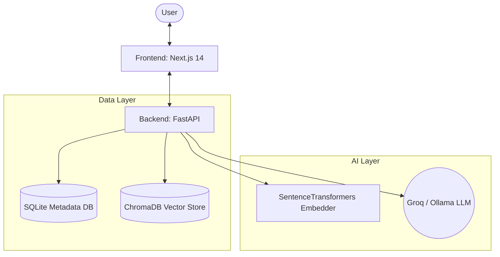

# iQuery — Architecture Overview

iQuery is a simple, modular Retrieval-Augmented Generation (RAG) system split into three distinct layers: Frontend, Backend API, and Data Persistence.

## High-Level Architecture

## System Components

### 1. Frontend (Next.js 14 + Tailwind)
- **Chat UI**: Interactive message bubbles with source citation cards, typing indicators, and inline feedback ratings. Persisted locally via `localStorage`.
- **Admin Panel**: Drag-and-drop document upload, indexed document management (list/delete), query logging analytics, and feedback viewer.

### 2. Backend (FastAPI Python)
The backend is internally segmented by responsibility:
- `api/` — Route handlers for ingestion, chat, admin, and feedback.
- `ingestion/` — File parsing (PyPDF2, python-docx) and chunking (LangChain `RecursiveCharacterTextSplitter`).
- `embeddings/` — Local, free embedding generation via `all-MiniLM-L6-v2`.
- `vectorstore/` — ChromaDB wrapper for storing embeddings and calculating cosine similarity.
- `retrieval/` — Orchestrates taking a query, embedding it, and searching the vector store.
- `generation/` — Constructs the strict grounding prompt and calls the LLM (Groq API or local Ollama).
- `db/` — Standard Python `sqlite3` driver tracking document status, query latency, and user feedback.

### 3. Data Persistence Context
- **ChromaDB**: Holds the heavy vector embeddings.
- **SQLite**: Holds structured relational data (document filenames, latency logs, user ratings). 

> [!CAUTION]
> **Ephemeral Storage on Render Free Tier**
> When deployed to the Render Free Tier, disks are wiped on every redeploy or idle-sleep wake scenario. As a result, stored documents and SQLite databases will reset. This is totally acceptable for a university demo / viva context (simply upload fresh documents at the start of the demo). For long-term production use, attach a Persistent Disk in Render ($7/month).
